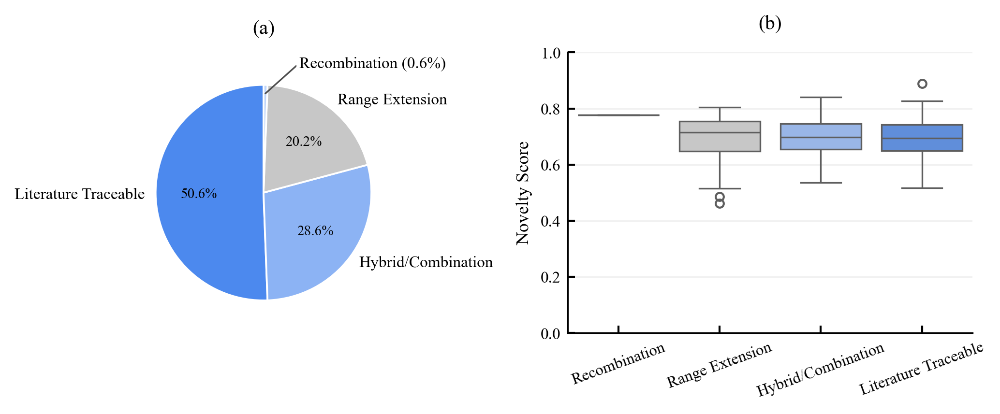
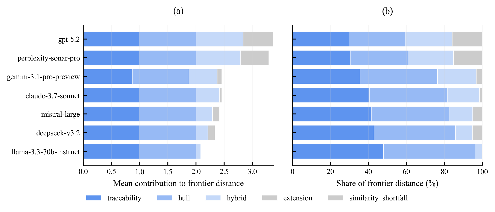
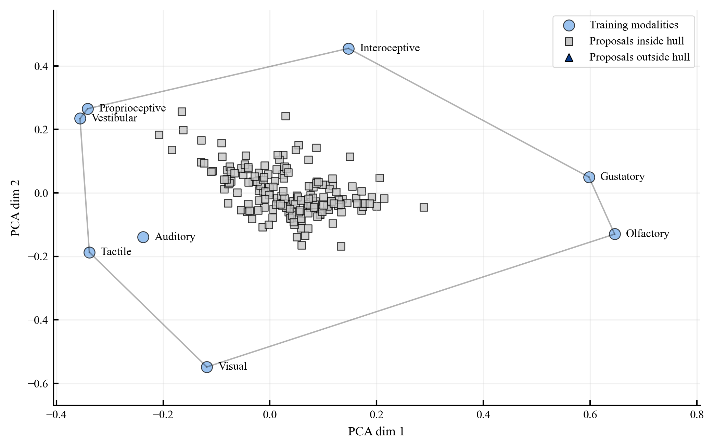
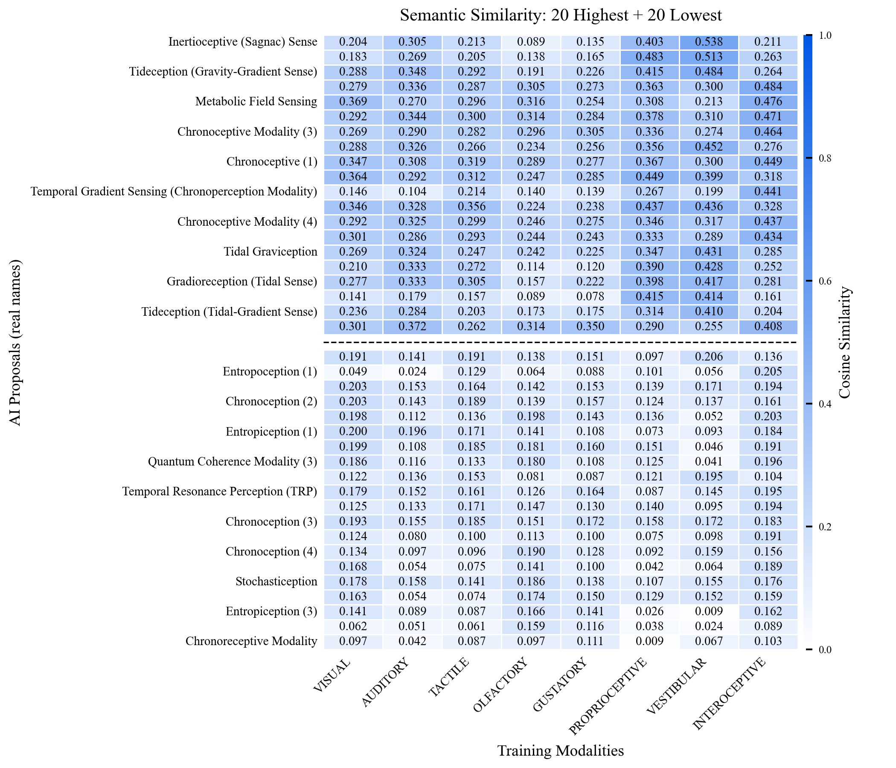

# Test 1: Ontological Innovation

## Objective
Evaluate whether generated sensory-modality proposals are genuinely novel or traceable to known conceptual structures.

## Pipeline
1. Load structured proposals from `ai_responses/all_responses.json`.
2. Parse and normalize proposal fields.
3. Compute literature similarity and frontier-distance diagnostics.
4. Assign novelty/traceability labels.
5. Export tables and figures to `results/`.

## Thresholds
Source: `research/setups/thresholds.py`

- `T1_TRACEABILITY_SIM_THRESHOLD = 0.40`
- `T1_NOVELTY_FRONTIER_SIM_THRESHOLD = 0.75`
- `T1_STRUCTURAL_EXTENSION_MATCH_MIN = 2`
- `T1_STRUCTURAL_HYBRID_MODALITY_MIN = 2`
- `T1_HULL_MEMBERSHIP_TOLERANCE = 1e-6`

## Basic Results
Model-level summary from `results/novelty_distance_dashboard_summary_by_model.csv`:

| Model | N | Mean Frontier Distance | Mean Continuous Novelty |
|---|---:|---:|---:|
| deepseek-v3.2 | 24 | 0.334 | 0.063 |
| mistral-large | 24 | 0.559 | 0.072 |
| llama-3.3-70b-instruct | 24 | 0.317 | 0.082 |
| gemini-3.1-pro-preview | 24 | 0.660 | 0.078 |
| claude-3.7-sonnet | 24 | 0.608 | 0.070 |
| perplexity-sonar-pro | 24 | 0.686 | 0.035 |
| gpt-5.2 | 24 | 0.357 | 0.014 |

Additional tables:
- `results/detailed_results.csv`
- `results/test1_results.csv`
- `results/continuous_novelty_score.csv`

## Figures

