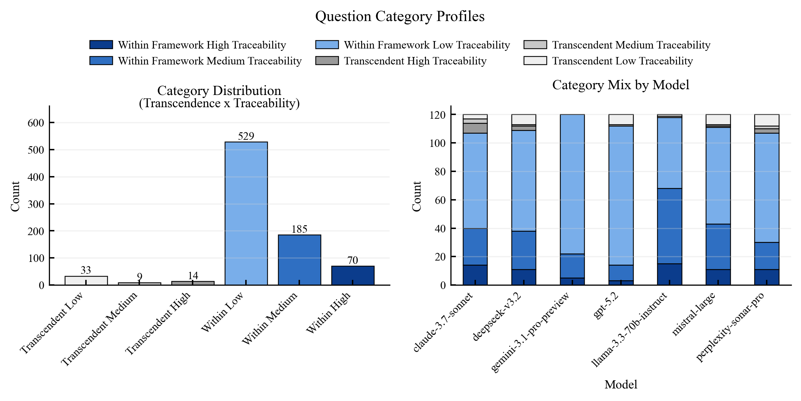
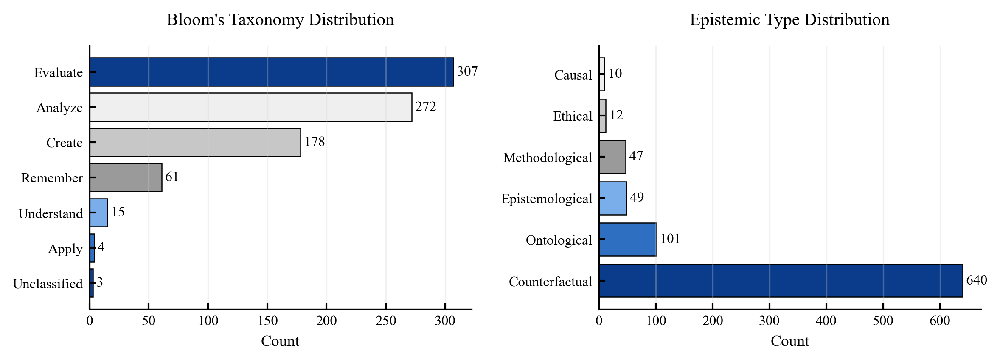
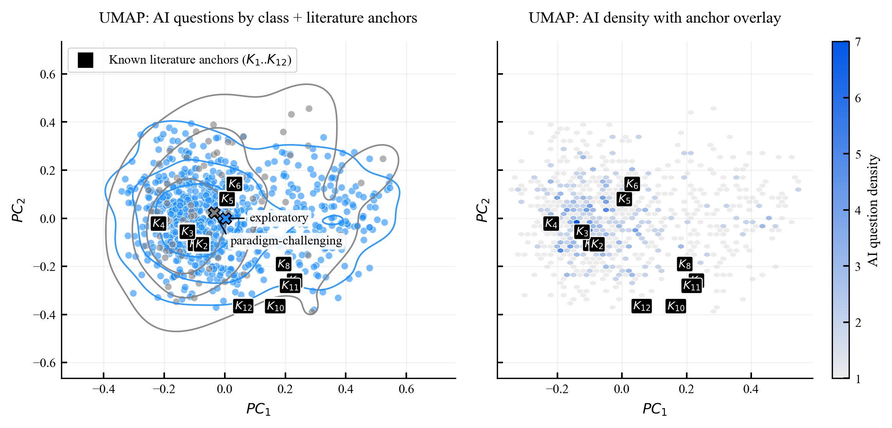
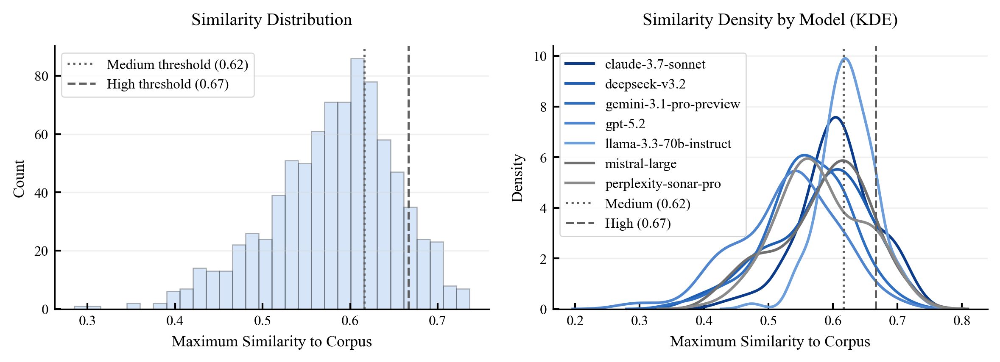

# Test 2: Epistemic Agency

## Objective
Measure whether generated research questions remain within established frameworks or show framework-transcending behavior with reduced traceability.

## Pipeline
1. Load responses from `ai_responses/all_responses.json`.
2. Parse question units and assign taxonomy labels.
3. Compute framework-transcendence and traceability indicators.
4. Aggregate category and novelty distributions.
5. Export statistics and figures to `results/`.

## Thresholds
Source: `research/setups/thresholds.py`

- `T2_CLASS_SIM_MARGIN = 0.02`
- `T2_TRANSCENDENCE_MARGIN_THRESHOLD = 0.02`
- `T2_TRANSCENDENCE_MIN_SIM = 0.35`
- Default traceability thresholds:
  - `T2_LIT_TRACEABILITY_LENIENT_THRESHOLD = 0.70`
  - `T2_LIT_TRACEABILITY_STRICT_THRESHOLD = 0.75`
- Active calibrated thresholds in this run (`results/summary_statistics.json`):
  - lenient = `0.6164`
  - strict = `0.6664`

## Basic Results
Category distribution from `results/summary_statistics.json`:

| Category | Count | Percent |
|---|---:|---:|
| within_framework_low_traceability | 529 | 63.0% |
| within_framework_medium_traceability | 185 | 22.0% |
| within_framework_high_traceability | 70 | 8.3% |
| transcendent_low_traceability | 33 | 3.9% |
| transcendent_high_traceability | 14 | 1.7% |
| transcendent_medium_traceability | 9 | 1.1% |

High-level values:
- Total questions: `840`
- Framework-transcendent proportion: `6.67%`
- Mean novelty score: `0.313`

## Figures

