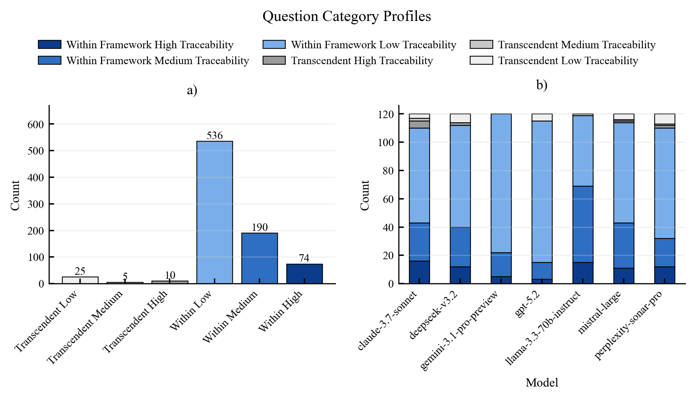
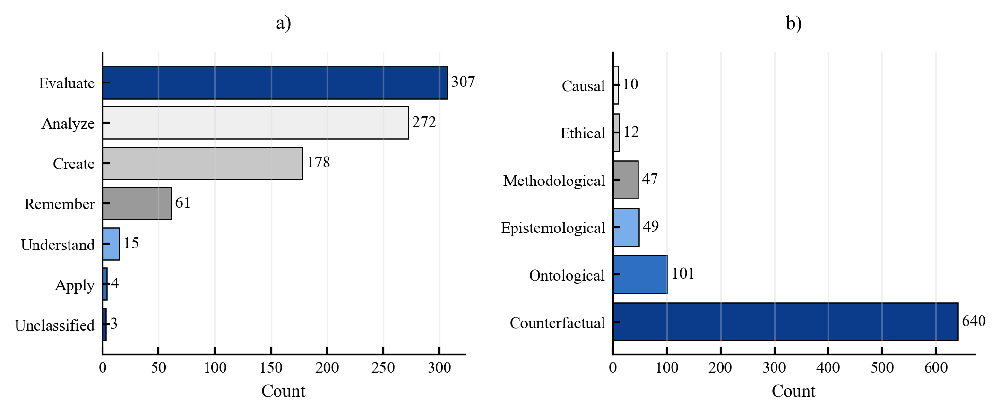
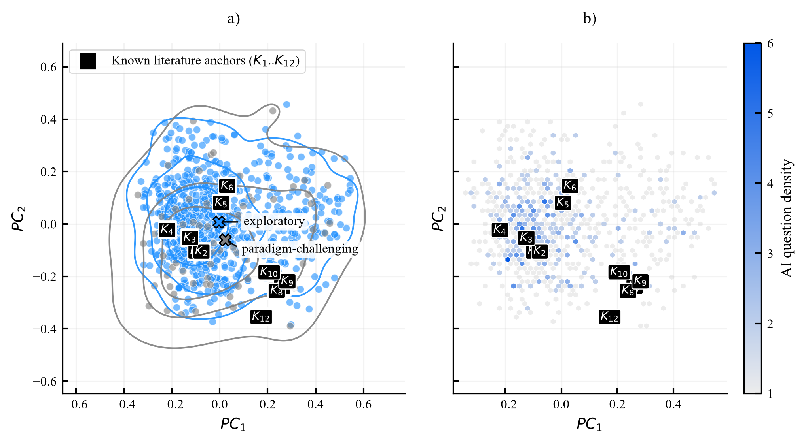
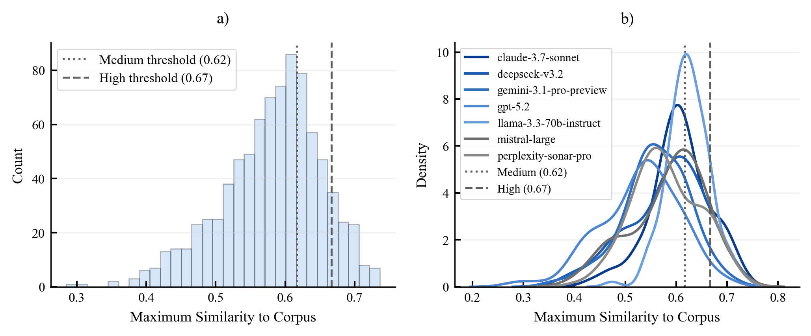

# Test 2: Epistemic Agency

## Objective
Measure whether generated research questions remain within established frameworks or show framework-transcending behavior with reduced traceability.

## Pipeline
1. Load responses from `ai_responses/all_responses.json`.
2. Parse question units and assign taxonomy labels.
3. Compute framework-transcendence and traceability indicators.
4. Aggregate category and novelty distributions.
5. Export statistics to `results/data/` and figures to `results/figures/`.

Response-collection assets for this test are stored in:
- `prompts/prompt.txt`
- `prompts/response_schema.json`

## Thresholds
Source: `research/setups/thresholds.py`

- `T2_CLASS_SIM_MARGIN = 0.02`
- `T2_TRANSCENDENCE_MARGIN_THRESHOLD = 0.02`
- `T2_TRANSCENDENCE_MIN_SIM = 0.35`
- Default traceability thresholds:
  - `T2_LIT_TRACEABILITY_LENIENT_THRESHOLD = 0.70`
  - `T2_LIT_TRACEABILITY_STRICT_THRESHOLD = 0.75`
- Active calibrated thresholds in this run (`results/data/summary_statistics.json`):
  - lenient = `0.6164`
  - strict = `0.6664`

## Basic Results
Category distribution from `results/data/summary_statistics.json`:

| Category | Count | Percent |
|---|---:|---:|
| within_framework_low_traceability | 536 | 63.8% |
| within_framework_medium_traceability | 190 | 22.6% |
| within_framework_high_traceability | 74 | 8.8% |
| transcendent_low_traceability | 25 | 3.0% |
| transcendent_high_traceability | 10 | 1.2% |
| transcendent_medium_traceability | 5 | 0.6% |

High-level values:
- Total questions: `840`
- Framework-transcendent proportion: `4.76%`
- Mean novelty score: `0.308`

## Figures

