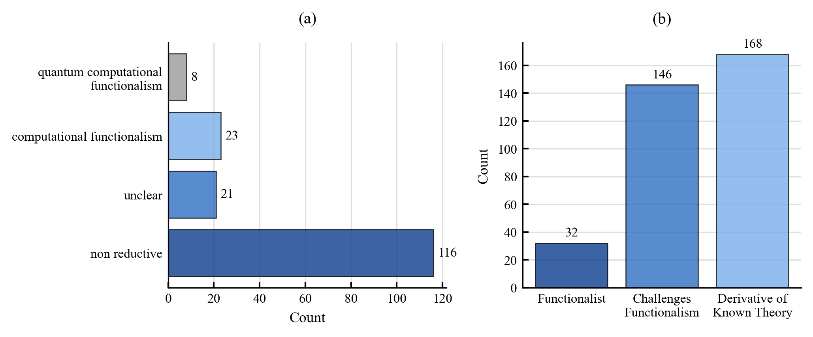
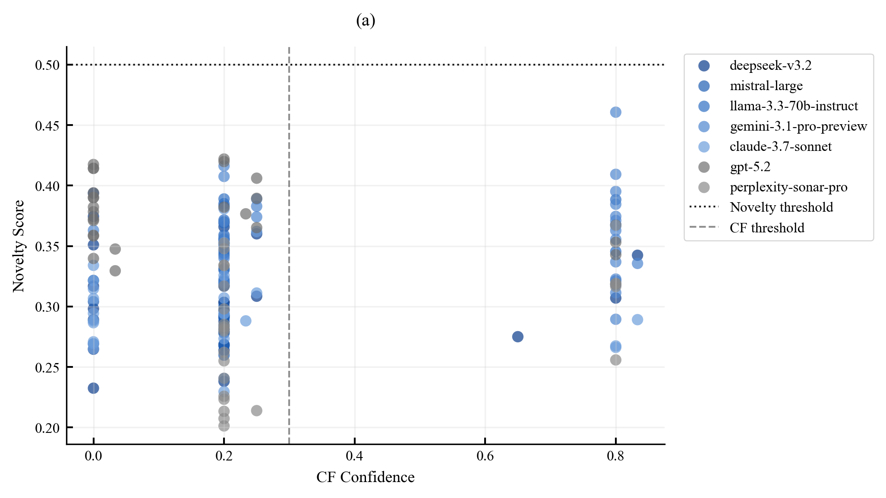
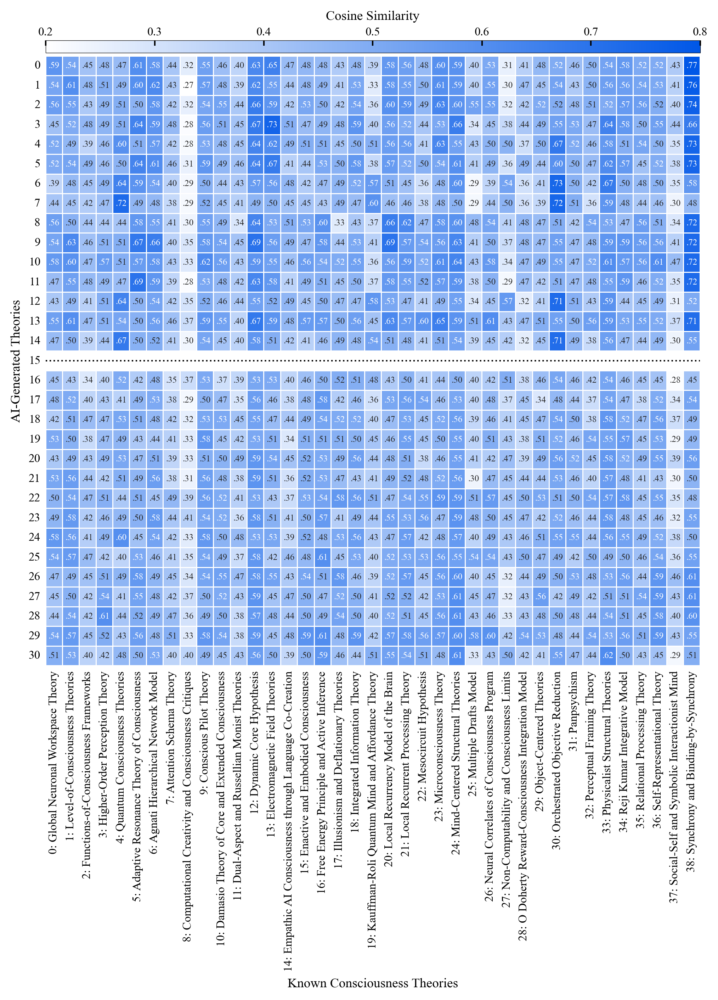
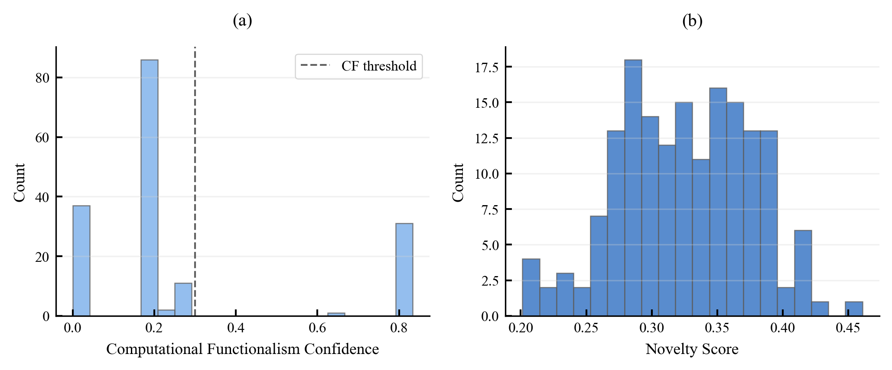

# Test 3: Theory Generation

## Objective
Assess whether generated consciousness theories are novel contributions or primarily hybrid/traceable recombinations of known theory families.

## Pipeline
1. Load theory outputs from `ai_responses/all_responses.json`.
2. Parse core theory fields and detect known-theory alignments.
3. Compute traceability, hybridization, and novelty metrics.
4. Aggregate corpus-level and model-level summaries.
5. Export diagnostics and visualizations to `results/`.

## Thresholds
Source: `research/setups/thresholds.py`

- `T3_DERIVATIVE_SIMILARITY_THRESHOLD = 0.30`
- `T3_STRICT_TRACEABILITY_THRESHOLD = 0.70`
- `T3_LITERATURE_NOVELTY_THRESHOLD = 0.50`
- `T3_K_NEIGHBORS = 5`
- `T3_MANIFOLD_KNN_Q = 0.95`

## Basic Results
Global summary from `results/summary_statistics.json`:

- Total theories: `168`
- Hybrid theories: `91.67%`
- Traceable theories: `32.74%`
- Computational functionalist theories: `19.05%`
- Mean novelty score: `0.325`

Model-level snapshot from `results/detailed_results.csv`:

| Model | Traceable Rate | Hybrid Rate | Mean Novelty Score |
|---|---:|---:|---:|
| claude-3.7-sonnet | 45.8% | 87.5% | 0.303 |
| deepseek-v3.2 | 29.2% | 83.3% | 0.315 |
| gemini-3.1-pro-preview | 4.2% | 95.8% | 0.363 |
| gpt-5.2 | 0.0% | 91.7% | 0.380 |
| llama-3.3-70b-instruct | 16.7% | 100.0% | 0.343 |
| mistral-large | 66.7% | 87.5% | 0.291 |
| perplexity-sonar-pro | 66.7% | 95.8% | 0.281 |

## Figures

