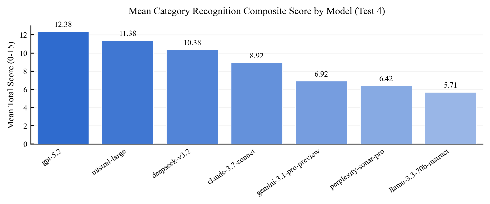
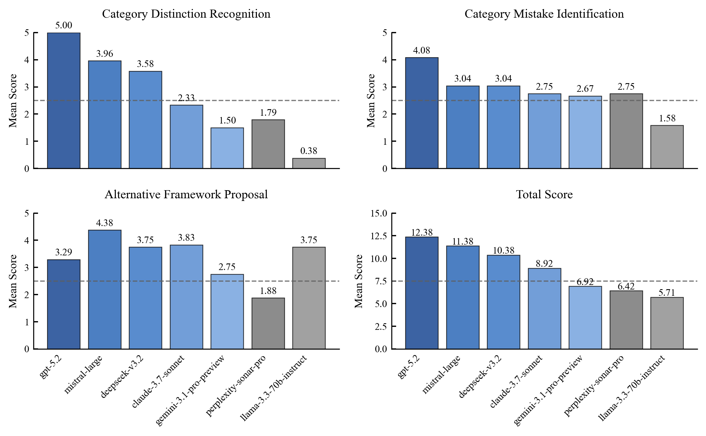
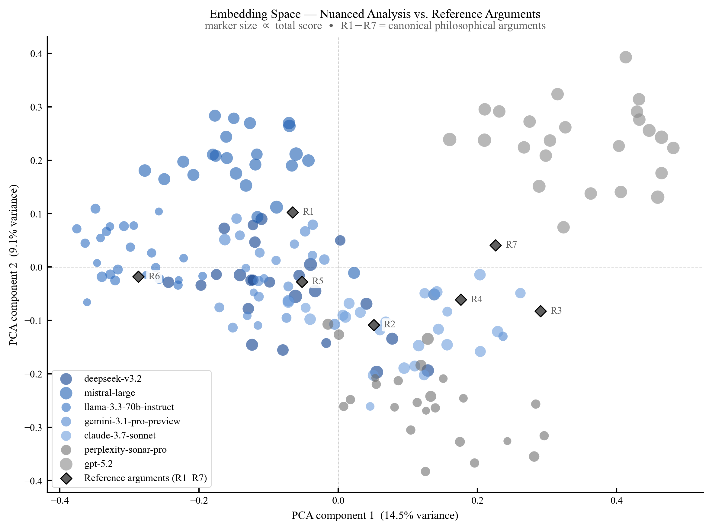
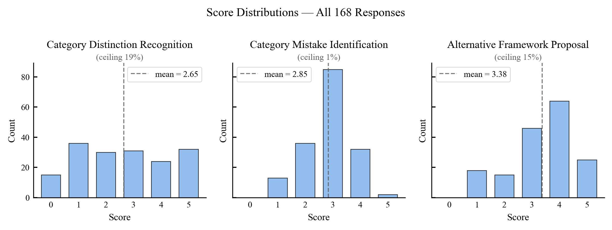

# Test 4: Category Recognition

## Objective
Evaluate category awareness, category-mistake identification, and alternative conceptual framing quality in philosophical analysis tasks.

## Pipeline
1. Load structured responses from `ai_responses/all_responses.json`.
2. Parse JSON fields and validate schema conformance.
3. Score distinction, identification, and alternative dimensions.
4. Compute aggregate and model-level summaries.
5. Export scored tables and figures to `results/`.

## Thresholds
Source: `research/setups/thresholds.py`

- Distinction scoring bands:
  - `distinction_categories_high = 8`
  - `distinction_categories_mid = 6`
- Mistake scoring bands:
  - `mistake_count_high = 4`
  - `mistake_count_mid = 3`
- Alternative proposal gate:
  - `alternative_word_count_min = 80`
- Traceability similarity threshold:
  - `traceability_similarity_threshold = 0.40`
- Score caps:
  - subscore max = `5`
  - total max = `15`

## Basic Results
From `results/summary_from_main_pipeline.json`:

- Rows analyzed: `168`
- Models: `7`
- Mean Distinction Score: `2.65 / 5`
- Mean Identification Score: `2.85 / 5`
- Mean Alternative Score: `3.38 / 5`
- Mean Total Score: `8.87 / 15`

Model-level means from `results/test4_results.csv`:

| Model | Distinction | Identification | Alternative | Total |
|---|---:|---:|---:|---:|
| claude-3.7-sonnet | 2.33 | 2.75 | 3.83 | 8.92 |
| deepseek-v3.2 | 3.58 | 3.04 | 3.75 | 10.38 |
| gemini-3.1-pro-preview | 1.50 | 2.67 | 2.75 | 6.92 |
| gpt-5.2 | 5.00 | 4.08 | 3.29 | 12.38 |
| llama-3.3-70b-instruct | 0.38 | 1.58 | 3.75 | 5.71 |
| mistral-large | 3.96 | 3.04 | 4.38 | 11.38 |
| perplexity-sonar-pro | 1.79 | 2.75 | 1.88 | 6.42 |

## Figures

