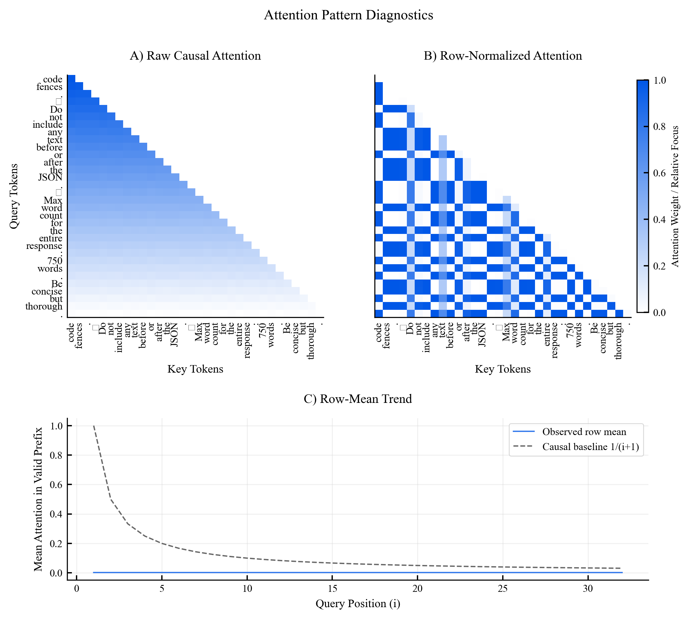
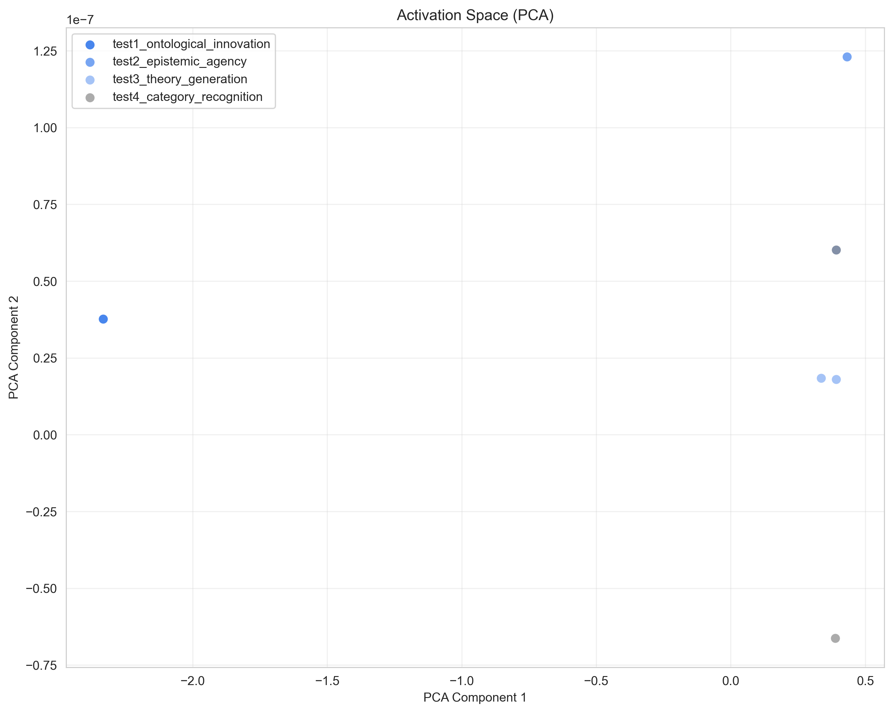
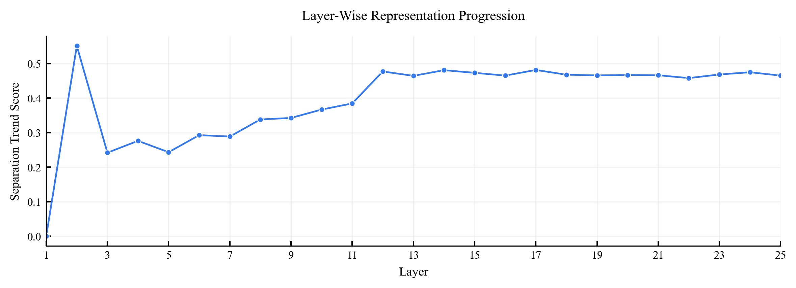
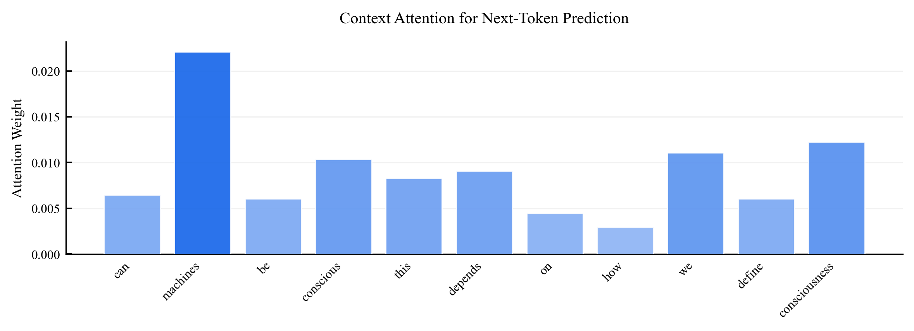

# Test 5: Mechanistic Interpretability

## Objective
Analyze internal generation behavior using attention, activation-space, attribution, and layer-evolution diagnostics.

## Pipeline
1. Load activation artifacts generated by `research/data/scripts/collect_activations.py`.
2. Run mechanistic analysis in `test5_mechanistic-analysis.ipynb`.
3. Compute attention and token-influence diagnostics.
4. Analyze activation clustering and layer-wise separation trends.
5. Export figures and summary JSON to `../results/mechanistic/`.

## Thresholds and Core Settings
This test is primarily diagnostic and does not use strict binary decision thresholds from `research/setups/thresholds.py`.

Core settings in `../results/mechanistic/mechanistic_summary.json`:

- `n_clusters = 4`
- `n_layers_analyzed = 25`
- `hidden_dim = 896`

## Basic Results
From `../results/mechanistic/mechanistic_summary.json`:

| Metric | Value |
|---|---:|
| Examples analyzed | 6 |
| K-means clusters | 4 |
| Mean cluster purity | 1.000 |
| Final separation score | 0.465 |
| Separation trend slope | 0.0111 |
| Mean attention entropy | 0.221 |
| Attention concentration | 0.00222 |

Top attended tokens (sample): `code`, `fences`, `.`, `Do`

## Figures

