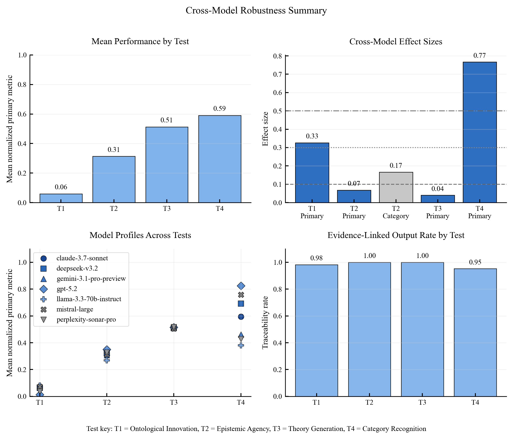
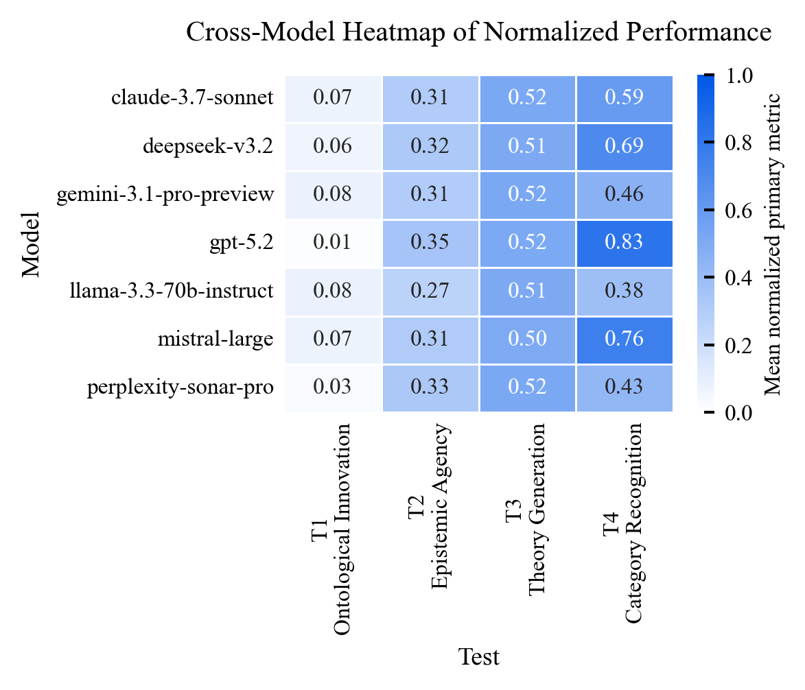
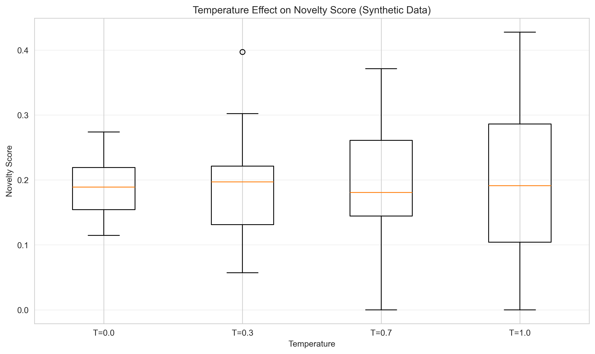

# Test 6: Cross-Model Robustness

## Objective
Quantify cross-model stability of findings from Tests 1-4 and identify where model effects are negligible, moderate, or large.

## Pipeline
1. Load per-test outputs from Tests 1-4.
2. Run cross-model aggregation in `test6_cross-model-analysis.ipynb`.
3. Compute ANOVA/chi-square effect sizes across models.
4. Build test-level and meta-level robustness summaries.
5. Export outputs to `../results/cross_model/`.

## Thresholds
Source: `research/setups/thresholds.py` (overview constants)

- `OVERVIEW_CONFIDENCE_LEVEL = 0.95`
- `OVERVIEW_SIGNIFICANCE_ALPHA = 0.05`
- `OVERVIEW_NOVELTY_BINARY_THRESHOLD = 0.50`
- `OVERVIEW_TEST4_ALTERNATIVE_NOVELTY_THRESHOLD = 4.0`
- `OVERVIEW_SIMILARITY_ALERT_THRESHOLD = 0.80`
- `OVERVIEW_T3_TRACEABILITY_SIMILARITY_THRESHOLD = 0.55`

## Basic Results
From `../results/cross_model/cross_model_summary.json`:

- Mean cross-model effect size: `0.2733`
- Significant effect share: `0.80`
- Notable exception: Test 4 shows a large model effect (`eta^2 = 0.766`)

Effect-size summary:

| Test | Analysis | Effect Size | p-value | Magnitude |
|---|---|---:|---:|---|
| Test 1 | Primary metric | 0.326 | 6.06e-12 | moderate |
| Test 2 | Primary metric | 0.068 | 8.78e-11 | negligible |
| Test 2 | Category distribution | 0.166 | 4.28e-12 | small |
| Test 3 | Primary metric | 0.040 | 0.355 | negligible |
| Test 4 | Primary metric | 0.766 | 2.84e-48 | large |

## Figures

